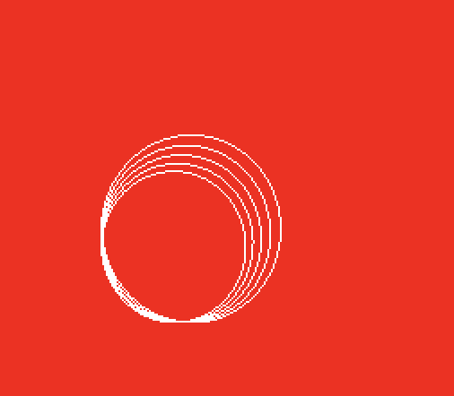
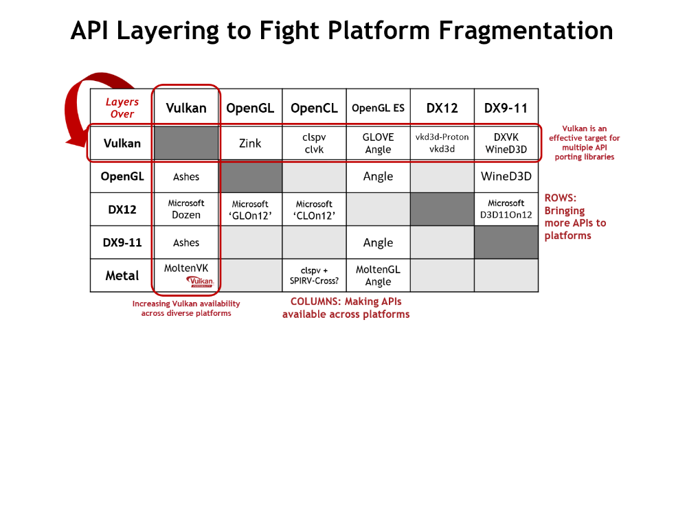

# Innledning

I denne oppgaven så skal Vulkan anvendes til å tegne en funksjon, en vektorfunksjon (en spiral) og en funksjon med to variable (en apesaddel). Først så blir de nødvendige datasettene generert og skrevet til en fil av en datamaskin. Deretter blir filene lastet inn og en funksjon, en vektorfunksjon, og så en funksjon med to variable, blir tegnet til skjermen med grafikkbiblioteket Vulkan.

Kildekoden for dette prosjektet er tilgjengelig herfra: [https://github.com/alanhaugen/mathematics-iii](https://github.com/alanhaugen/mathematics-iii)

En spillmotor har blitt skrevet for dette prosjektet som har alle de Vulkan-spesifikke kildekodeinstruksjonene. Koden i spillmotoren som er skrevet spesifikt for Vulkan-støtte er tilgjengelig herfra: [https://github.com/alanhaugen/solid/tree/master/source/modules/renderer/vulkan](https://github.com/alanhaugen/solid/tree/master/source/modules/renderer/vulkan)

# Oppgave 1

I oppgave 1 så ble følgende funksjon valgt: $f(x) = x^3 - 6x^2 + 11x - 6$

I denne oppgaven ble datapunkter for grafen til denne funksjonen beregnet, og punktene ble lagret på tekstformat der første linje er antall hjørner (vertekser), etterfulgt av hjørner linjevis.

Den deriverte av funksjonen ble også definert: $f\prime(x) = 3x^2 - 12x + 11$

Den deriverte er brukt til å sette farge på linjestykkene. Når linjen stiger så blir grafen grønn. Når grafen avtar så blir linjen blå. Bakgrunnen på bilde er rødt. Se figur 1.

    mathematics-iii/source/oppgave1.cpp:
    // 1. Velg en egen funksjon f(x) og en passende definisjonsmengde D_f = [a, b].
    d_f = Df(-1000, 1000);

    // 2. Velg antall intervaller n slik at du får n + 1 punkter x0,x1,...,xn
    // og oppløsning h = dx = (b−a) / n
    n = 10000;
    h = (d_f.b - d_f.a) / n;

    // 3. Regn ut funksjonsverdier f(x_i) i hvert punkt.
    // Regn også ut f'(x) i hvert punkt.
    double x = d_f.a;

    float green, red;

    std::vector<Vertex> vertices;

    for (unsigned int i = 0; i < n + 1; i++)
    {
        // 4. Bestem en farge for hvert verteks slik at grafen får en farge når funksjonen er
        // stigende, og en annen farge når funksjonen er avtakende.
        if (df(x) > 0.0)
        {
            green = 1.0;
            red = 0.0;
        }
        else
        {
            green = 0.0;
            red = 1.0;
        }

        // 5. Beregn funksjonsverdi og skriv ut verteksdata for hvert punkt på en teksfil.
        // På første linje i filen skal antall punkter stå.
        // Deretter følger verteksdata for hvert punkt linje for linje.
        vertices.push_back(Vertex(x, f(x), 0.0f, red, green, 0.0f));

        x += h;
    }

    // Write file
    dataFile = fopen("data.txt", "w+");

    fprintf(dataFile, "%s%zu%s", "#", vertices.size(), "\n");

    for(const Vertex& v : vertices)
    {
        fprintf(dataFile, "%f %f %f %f %f %f%s", v.x, v.y, v.z, v.r, v.g, v.b, "\n");
    }

    fclose(dataFile);

Merk at jeg anvender det gamle C-biblioteket, stdlib, til å gjøre filhåndtering. Etter min mening så er dette biblioteket mye lettere å jobbe med sammenlignet med det nye som har blitt introdusert med C++.

Her er et eksempel på utmatningen til programmet:

    #10001
    -1000.000000 -1006011008.000000 0.000000 0.000000 1.000000 0.000000
    -999.799988 -1005408704.000000 0.000000 0.000000 1.000000 0.000000
    -999.599976 -1004806656.000000 0.000000 0.000000 1.000000 0.000000
    -999.400024 -1004204864.000000 0.000000 0.000000 1.000000 0.000000
    ...

Dataene ble visualisert med Vulkan via spillmotoren. Se figur 1 nedenfor.

 = x^3 - 6x^2 + 11x - 6$. Når funksjonen stiger så blir grafen grønn. Når grafen avtar så blir grafen blå.")

# Oppgave 2

I oppgave 2 så blir en spiral generert og tegnet til skjermen. Den blir generert på følgende måte:

    // Lag en fil med datapunkter for en tredimensjonal spiral
    // Bestem selv en steglengde for parameteren t og verteksfarger
    float n = (2 * M_PI) * 5;

    float red = 1.0;
    float green = 0.0;

    float x = 0;
    float y = 0;

    float radius = 1.0f;
    float height = 0.0f;

    float step = 0.1;

    std::vector<Vertex> vertices;

    for (float i = 0; i < n; i+=step)
    {
        x = radius - cos(i);
        y = radius - sin(i);

        green += i / n; // gradient from 0.0 up to 1.0

        height += 0.01;

        // Store vertex in vertices list
        vertices.push_back(Vertex(x, y, height, red, green, 0.0f));
    }

    // Write to file
    dataFile = fopen("data2.txt", "w+");

    fprintf(dataFile, "%s%lu%s", "#", vertices.size(), "\n");

    for(const Vertex& v : vertices)
    {
        fprintf(dataFile, "%f %f %f %f %f %f%s", v.x, v.y, v.z, v.r, v.g, v.b, "\n");
    }

Dette gir spiralen som vist i figur 2 nedenfor.

# Oppgave 3

I oppgave 3 så blir en apesaddel generert og tegnet til skjermen. Følgende funkson anvendes til å lage z-posisjonene til apesaddelen:

$x^2y$

Denne implementasjonen er nærmest identisk til den som er i forelesningsnotatene på side 13. 

    double f(const double x, const double y)
    {
        return pow(x, 2*y);
    }

    std::vector<Vertex> vertices;

    float xmin=0.0f, xmax=1.0f, ymin=0.0f, ymax=1.0f, h=0.25f;
    for (float x=xmin; x<xmax; x+=h)
    {
        for (float y=ymin; y<ymax; y+=h)
        {
            float z = f(x, y);
            vertices.push_back(Vertex(x,y,z,x,y,z));
            z = f(x+h, y);
            vertices.push_back(Vertex(x+h,y,z,x,y,z));
            z = f(x, y+h);
            vertices.push_back(Vertex(x,y+h,z,x,y,z));
            vertices.push_back(Vertex(x,y+h,z,x,y,z));
            z = f(x+h, y);
            vertices.push_back(Vertex(x+h,y,z,x,y,z));
            z = f(x+h, y+h);
            vertices.push_back(Vertex(x+h,y+h,z,x,y,z));
        }
    }

For å tegne apesaddelen så ble triangler anvendt isteden for linjestykker.

# Diskusjon

Det ble skrevet kode til å laste inn dataene fra oppgave 1, 2, og 3, og tegne den med Vulkan. For å støtte forskjellige grafikkbibliotek så har et API blitt definert som abstraherer bort det som er spesifikt per grafikkbibliotek. Koden følger "Service Locator" mønsteret slik det er beskrevet av Robert Nystrøm i boken Game Programming Patterns (2021): [http://gameprogrammingpatterns.com/service-locator.html](http://gameprogrammingpatterns.com/service-locator.html)

Spillmotoren har tilsammen 7 tjenester som er tilgjengelig via Locator mønsteret. Renderer, Audio, Input, Physics, AI, Script og Filesystem.

Spillmotoren følger også Game Loop mønsteret, som er beksrevet av Nystrøm (2021) i Game Programming Patterns: ([http://gameprogrammingpatterns.com/game-loop.html](http://gameprogrammingpatterns.com/game-loop.html)). Merk at spillmotoren heter solid. Denne koden er definert i solid/source/core/x-platform/services.cpp. Det viktigste i motoren er Scenes.

En Scene må legges til prosjektet for at main loop skal virke som den skal. Dette gjøres i main.cpp

    mathematics-iii/source/main.cpp:
    #include <core/application.h>
    #include "oppgave1.h"
    #include "oppgave2.h"
    #include "oppgave3.h"
    
    int main(int argc, char **argv)
    {
        Application application(argc, argv);
    
        application.AddScene(new oppgave1());
        application.AddScene(new oppgave2());
        application.AddScene(new oppgave3());
    
        return application.Exec();
    }

Hver Scene består av en kontainer (dynamisk array) med pekere til komponenter. Med andre ord, spillmotoren følger også Components mønsteret fra Nystrøm (2021): [http://gameprogrammingpatterns.com/component.html](http://gameprogrammingpatterns.com/component.html).

    solid/source/core/x-platform/scene.h:

    Array<Ptr<Component* > > components;

Merk at en smart pointer anvendes slik at det som legges inn i components skal slettes når scene blir slettet.

For å faktisk tegne grafikken anvendes renderer locator. Her er det et konsept som heter drawables. En renderer tegner drawables, og er en abstrakt fabrikk (Gamma m. fl. 1994 s. 87) som kan generere drawables.

    Array<unsigned int> indices;
    Array<String> shaders(2);
    shaders.Insert("data/simple.vert", VERTEX_SHADER);
    shaders.Insert("data/simple.frag", FRAGMENT_SHADER);

    Array<ITexture*> textures = Array<ITexture*>(); // Empty array

    Array<IDrawable::Vertex> vertices;

    vertices.Add( ... );

    IDrawable* lines = renderer->CreateDrawable(vertices,
                                                indices,
                                                shaders,
                                                textures,
                                                DRAW_LINES);

Ved å kode på denne måten så blir det ingen Vulkan eller OpenGL, eller annen grafikkbibliotek-kode, i spillogikken. Det blir enkelt å bytte ut grafikkbiblioteket med andre API-er, det blir også lettere å gjøre interessante eksperimenter.

Det finnes allerede en moderne OpenGL renderer for solid. Denne gjør uniforms på en annen måte sammenlignet med Vulkan. I Vulkan så har man uniform blocks, men kan ikke slå opp og laste opp uniforms basert på en streng, slik som i OpenGL. Dette er noe jeg må jobbe mer på, fordi jeg ønsker et enkelt API for å sende uniforms til mine shaderprogrammer.

For å implementere Vulkan renderer så ble vkguide.dev fulgt. Arbeidet ble i tillegg gjort på en Mac. MacOS støtter ikke lenger OpenGL, og støtter heller ikke Vulkan offisielt. For macOS og iOS så anvendes Metal, som er Apple sitt eget grafikkbibliotek. Men det finnes portability layers for å motvirke plattformfragmentasjonen som finnes på markedet i dag. Se figuren nedenfor.

Jeg bruker fortsatt macOS 10.13 High Sierra ettersom den støtter fortsatt moderne OpenGL. For å få Vulkan 1.0 til å virke på min Mac så anvendte jeg MoltenVK v1.0.34:

    git clone git@github.com:KhronosGroup/MoltenVK.git
    cd MoltenVK
    git checkout v1.0.34

Instruksjonene for denne versjonen av MoltenVK er lette å følge. MoltenVK lenkes vanligvis inn som et statisk bibliotek.

    ./fetchDependencies
    make macos

Det statiske biblioteket blir lagt her: Package/Release/MoltenVK/macOS/static/libMoltenVK.a

Include filene som anvendes av Vulkan og MoltenVK på mac er her: Package/Release/MoltenVK/include/

Jeg bruker både qbs og make build systemene. Jeg synes det er lettest å bruke make til å lage endringer på min kodebase. Følgende ble lagt til i min solid/Makefile.generic:

    RENDERER   ?= VulkanRenderer
    RENDERER_HEADER   ?= "modules/renderer/vulkan/vulkanrenderer.h"
    LIBS += -lvulkanrenderer
    LIBS += -framework QuartzCore -framework IOSurface -lMoltenVK

Det står mer informasjon om hva en trenger for å få MoltenVK til å virke på Mac i dokumentet Docs/MoltenVK_Runtime_UserGuide.md

Et verktøy som er nødvendig for å bruke Vulkan på Mac er MoltenVKShaderConverter som blir kompilert og lagt i mappen Package/Release/MoltenVKShaderConverter/Tools. Dette programmet er brukt til å omgjøre GLSL programmer til SPIR-V for MoltenVK. Jeg har skrevet en Asset Conditioning Pipeline (ala [http://graphics.cs.cmu.edu/courses/15-466-f19/notes/asset-pipelines.html](http://graphics.cs.cmu.edu/courses/15-466-f19/notes/asset-pipelines.html)) som automatisk oppdaterer shader filene mine og omgjør dem til spv ved å anvende MoltenVKShaderConverter. Dette systemet er en del av make build systemet og ser slik ut:

    intermediate/%.frag.spv: data/%.frag
        $(SPV_COMPILER) -t f -gi $@ -so intermediate/$<
    
    intermediate/%.vert.spv: data/%.vert
        $(SPV_COMPILER) -t v -gi $@ -so intermediate/$<

Jeg fulgte guiden på [https://vkguide.dev/docs/old_vkguide/](https://vkguide.dev/docs/old_vkguide) for å få alt til å virke. Jeg bruker Vulkan 1.0. Jeg lærte om initialiseringen av Vulkan, hva en Vulkan instance er, hva physical devices er. Jeg lærte hvordan velge en physical device med graphics og present queues for så å lage en Vulkan device med den. Jeg lærte også hvordan å lage en KHR Surface og bruke SDL til å tegne Vulkan grafikk til et vindu. Jeg lærte om swapchain, render passes, rendering løkken til Vulkan, pipelines, push constants (som er unikt for Vulkan) og hvordan bruke descriptor sets til å sende og oppdatere uniforms til GPU-en via Vulkan.

Jeg har enda ikke lagt inn teksturer, som gjøres med descriptor sets i Vulkan. Etter dette så har jeg en Vulkan renderer som har alle egenskapene til OpenGL renderern. Jeg har enda ikke løst å sende inn Uniform Blocks på en måte som jeg er fornøyd med.

I solid så har jeg støtte til å fly rundt scenen med det jeg kaller et FPS kamera, i tillegg så har jeg tekststøtte. Å tegne tekst i OpenGL og Vulkan er overraskende vanskelig å få til. Det vil kreve teksturstøtte, og det vil kreve at jeg løser hvordan uniforms gjøres i Vulkan. Jeg ønsker deretter å se på mer avanserte ting, slik som skinning (altså animasjon), physically based rendering (PBR), kollisjonsdeteksjon (fysikk), og video playback (fmv).

Her er litt kode fra oppgave 1.

    Camera* cam = new Camera(0.0f, 0.0f, 10.0f);

    components.Add(cam);
    components.Add(new FPSCamera(cam));
    components.Add(new Text("oppgave 1"));
    components.Add(new Text("f(x) = x^3 - 6x^2 + 11x - 6", 0.0f, 100.0f));

Denne koden i oppgave 1 gjør at en kan fly rundt i scenen og se tekst på skjermen, i tillegg til grafen. For å fullføre Vulkan implementasjonen så må jeg få inn teksturstøtte og lage et pent API for å sende inn uniforms.

# Kilder

Design Patterns: Elements of Reusable Object-Oriented Software: Erich Gamma, Richard Helm, Ralph Johnson, John Vlissides, Grady Booch: 9780201633610: Amazon.com: Books. (n.d.). Retrieved February 3, 2025, from https://www.amazon.com/Design-Patterns-Elements-Reusable-Object-Oriented/dp/0201633612

Table of Contents · Game Programming Patterns. (n.d.). Retrieved February 3, 2025, from http://gameprogrammingpatterns.com/contents.html

